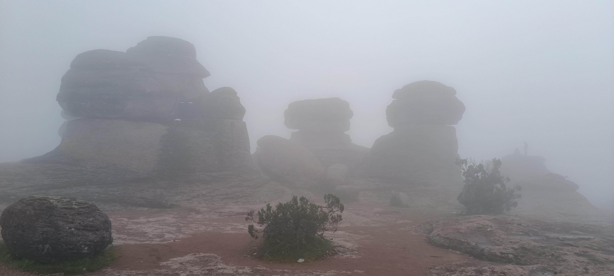
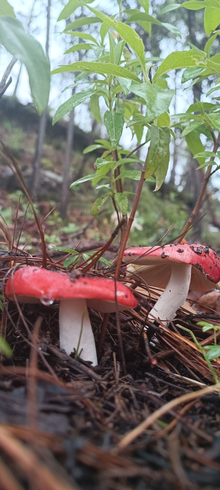

¡Hola!

Este fin de semana nos lanzamos a una aventura en el corazón de la Sierra Madre Occidental: el Parque Natural Mexiquillo, en Durango. Sin duda un lugar para desconectarse de la rutina y conectar con la naturaleza.

## ¿Qué hacer en Mexiquillo?

Mexiquillo es famoso por sus paisajes boscosos, formaciones rocosas que parecen de otro planeta y sus impresionantes cascadas. Aquí les dejo lo imperdible:

*   **El Jardín de Piedras:** Caminen entre gigantescas formaciones rocosas volcánicas... de película!

*   **Cascada de Mexiquillo:** Una caída de agua impresionante. El sonido y la vista son espectaculares.

*   **Los Túneles de la antigua vía de tren:** Exploren los túneles que atraviesan las montañas, un vestigio del proyecto ferroviario que nunca se concretó. Es una caminata llena de historia, (y muy larga x.x).

*   **Estanque de peces:** Al final de los túneles, se encontraran con una pequeña cabaña al lado de los estanques de peces donde pueden pasar el rato mientras degustan una trucha.

Tuvimos la fortuna de tener un clima muy húmedo, lo que propició una vistas geniales con neblina! Fue el clima y ambiente perfecto para una muy larga caminata.

## Tips para el viaje

*   **Hospedaje:** Hay cabañas rústicas que pueden rentar para una experiencia completa.
*   **Clima:** El clima es de montaña, así que preparados para el frío, incluso en verano.
*   **Comida:** No se pierdan la comida local en los pequeños restaurantes de la zona. ¡Prueben la birria!

Espero que esta mini-guía los anime a visitar este rincón mágico de México.