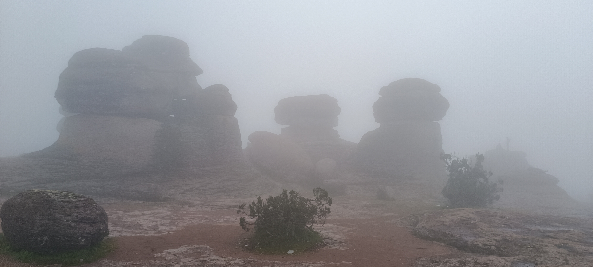
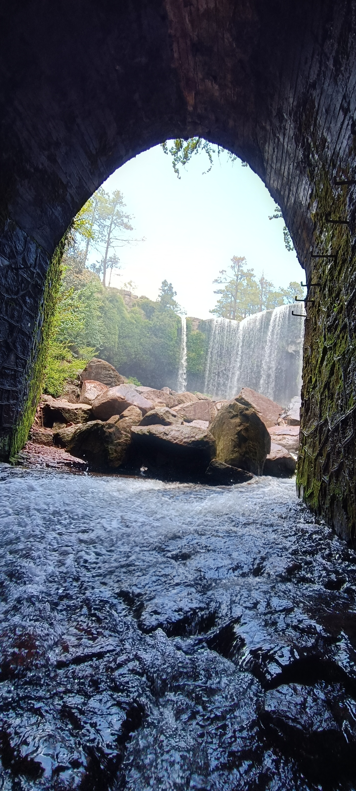
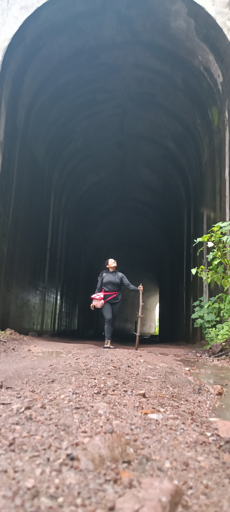
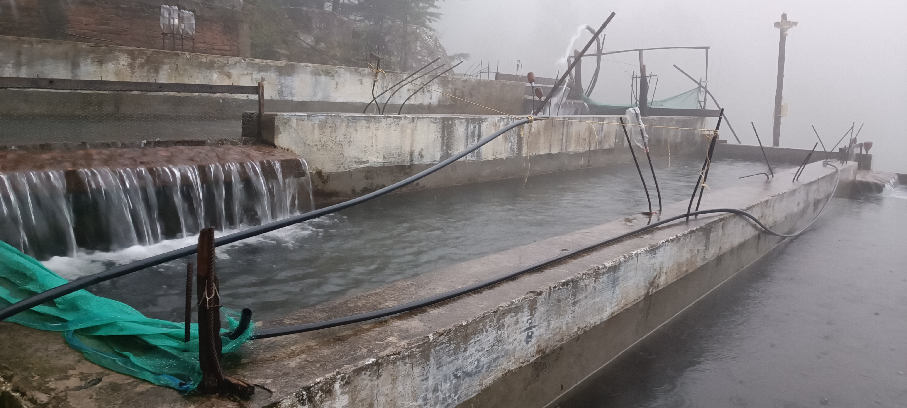
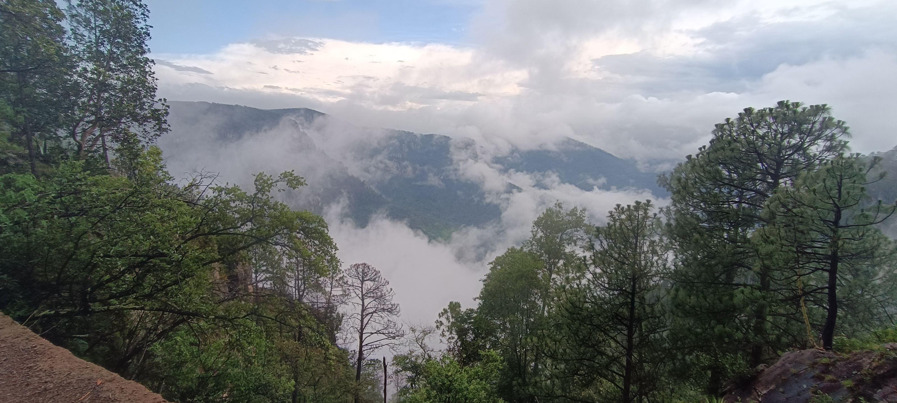
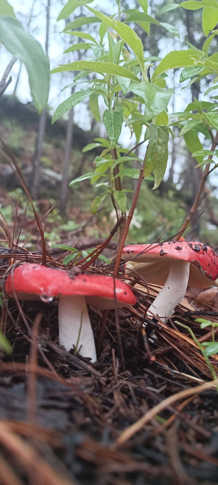

Hello!

This weekend we set off on an adventure deep in the heart of the Sierra Madre Occidental: Mexiquillo Natural Park, in Durango. It's definitely a place to disconnect from the daily grind and reconnect with nature.

## What to do in Mexiquillo?

Mexiquillo is known for its forested landscapes, otherworldly rock formations, and stunning waterfalls. Here's what you absolutely can't miss:

*   **The Stone Garden:** Walk among massive volcanic rock formations... straight out of a movie!

*   **Mexiquillo Waterfall:** A breathtaking cascade. The sound and view are spectacular.

*   **Old railway tunnels:** Explore the tunnels that cut through the mountains—remnants of a railway project that was never completed. It's a hike full of history (and super long x.x).

*   **Fish pond:** At the end of the tunnels, you'll find a small cabin next to fish ponds where you can relax and enjoy some fresh trout.

We were lucky to have very humid weather, which gave us amazing misty views! It was the perfect atmosphere for a long, long hike.

## Travel Tips

*   **Lodging:** There are rustic cabins available to rent for a full-on nature experience.
*   **Weather:** It's mountain weather, so be prepared for chilly temperatures—even in summer.
*   **Food:** Don’t miss out on the local cuisine at the small restaurants around the area. Try the birria!

Hope this mini-guide inspires you to visit this magical corner of Durango-Mexico.
